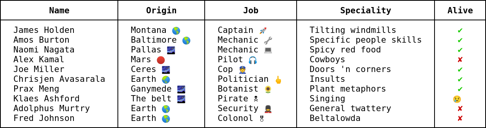

Go package to print nicely aligned tables in the terminal.



Import at `zgo.at/acidtab`. Godoc: https://godocs.io/zgo.at/acidtab

You can view all these examples in your terminal with `go test -v`.

Basic usage
-----------

```go
// Create a new table
t := acidtab.New("Name", "Origin", "Job", "Speciality", "Alive")

// Add rows
t.Row("James Holden", "Montana", "Captain", "Tilting windmills", true)
t.Row("Amos Burton", "Baltimore", "Mechanic", "Specific people skills", true)

// And then print it:
t.Horizontal(os.Stdout)
```

Outputs:

          Name      │   Origin    │    Job     │        Speciality        │  Alive
    ────────────────┼─────────────┼────────────┼──────────────────────────┼─────────
      James Holden  │  Montana    │  Captain   │  Tilting windmills       │  true
      Amos Burton   │  Baltimore  │  Mechanic  │  Specific people skills  │  true

*Note*: because GitHub adds a line-height there are little gaps between the
vertical dividers. You don't have this in a terminal.

Options
-------
There are a bunch of options you can set:

```go
t := acidtab.New("Name", "Origin", "Job", "Speciality", "Alive")

t.Borders(acidtab.BordersHeavy)               // Set different borders.
t.Pad(" ")                                  // Pad cells with one space.
t.Prefix(" ")                               // Prefix every line with a space.
t.Close(acidtab.CloseTop | acidtab.CloseBottom) // "Close" top and bottom.
t.Header(false)                             // Don't print the header.

t.Row("Naomi Nagata", "Pallas", "Mechanic", "Spicy red food", true)
t.Row("Alex Kamal", "Mars", "Pilot", "Cowboys", false)

t.Horizontal(os.Stdout)
```

Outputs:

     ━━━━━━━━━━━━━━┳━━━━━━━━┳━━━━━━━━━━┳━━━━━━━━━━━━━━━━┳━━━━━━━
      Naomi Nagata ┃ Pallas ┃ Mechanic ┃ Spicy red food ┃ true
      Alex Kamal   ┃ Mars   ┃ Pilot    ┃ Cowboys        ┃ false
     ━━━━━━━━━━━━━━┻━━━━━━━━┻━━━━━━━━━━┻━━━━━━━━━━━━━━━━┻━━━━━━━


- The default for `Pad()` is two spaces.

- The default for `Prefix()` is an empty string.

- `acidtab.CloseLeft` and acidtab.CloseRight` can be used to add borders to the
  left and right too, or `acidtab.CloseAll` to add borders to all sides.

- The default for `Borders` is `acidtab.BordersHeavy`; also see the other
  `Borders*` variables, and you can define you own. Note you *need* to define
  all used characters, otherwise it will print the zero value (a NULL byte).

Column options
--------------
You can set options for columns:

```go
t := acidtab.New("Name", "Origin", "Job", "Speciality", "Alive")
t.Close(acidtab.CloseLeft | acidtab.CloseRight)

t.AlignCol(3, acidtab.Right) // Align column 3 and 4 (starts at 0)
t.AlignCol(4, acidtab.Center)

t.FormatCol(3, "%q") // Print column 3 as %q

// Callback for column 4
t.FormatColFunc(4, func(v interface{}) string {
    if b, ok := v.(bool); ok {
        return map[bool]string{true: "yes", false: "no"}[b]
    }
    // Return a NULL byte to fall back to regular formatting.
    return "\x00"
})

t.Row("Joe Miller", "Ceres", "Cop", "Doors 'n corners", false)
t.Row("Chrisjen Avasarala", "Earth", "Politician", "Insults", true)

t.Horizontal(os.Stdout)
```

Outputs:

    │         Name         │  Origin  │     Job      │      Speciality      │  Alive  │
    ├──────────────────────┼──────────┼──────────────┼──────────────────────┼─────────┤
    │  Joe Miller          │  Ceres   │  Cop         │  "Doors 'n corners"  │   no    │
    │  Chrisjen Avasarala  │  Earth   │  Politician  │           "Insults"  │   yes   │


- `AlignCol()` sets the column alignment; the default is `Auto`, which
  right-aligns numbers (int, float) and left-aligns everything else.

- `FormatCol()` sets how the value is printed with `fmt.Sprintf`. The default if
  `%v`.

- `FormatColFunc()` sets a callback to print the value instead, in this case to
  show something nicer than "true" or "false". Return a NULL byte to fall back
  to `fmt.Sprintf` formatting.

  `acidtab.FormatAsNum` can be used to print numbers with thousands separators
  (only `,` at the moment, not locale-aware). e.g. `FormatColFunc(1,
  acidtab.FormatAsNum())`.

The column indexes start at zero. Note these are not checked: if you defined
fewer headers then you will get a panic.

Vertical table
--------------
You can print a "vertical" table with `Vertical()`:

```go
t := acidtab.New("Name", "Origin", "Job", "Speciality", "Alive")
t.Row("Prax Meng", "Ganymede", "Botanist", "Plant metaphors", true)
t.Row("Klaes Ashford", "The belt", "Pirate", "Singing", "😢")
t.Vertical(os.Stdout)
```

Outputs:

      Name        │  Prax Meng
      Origin      │  Ganymede
      Job         │  Botanist
      Speciality  │  Plant metaphors
      Alive       │  true
    ──────────────┼───────────────────
      Name        │  Klaes Ashford
      Origin      │  The belt
      Job         │  Pirate
      Speciality  │  Singing
      Alive       │  😢

Most options for horizontal tables work for this as well, but disabling the
header has no effect (it would be a bit pointless) and data is always
left-aligned.

Chaining
--------
All options can be chained:

```go
acidtab.New("Name", "Origin", "Job", "Speciality", "Alive").
    Close(acidtab.CloseTop|acidtab.CloseBottom).
    Prefix(" ").
    Pad(" ").
    FormatCol(1, "%q").
    Rows(
        "Adolphus Murtry", "Earth", "Security", "General twattery", false,
        "Fred Johnson", "Earth", "Colonol", "Beltalowda", false,
    ).
    Vertical(os.Stdout)
```

Outputs:

     ────────────┬──────────────────
      Name       │ Adolphus Murtry
      Origin     │ "Earth"
      Job        │ Security
      Speciality │ General twattery
      Alive      │ false
     ────────────┼──────────────────
      Name       │ Fred Johnson
      Origin     │ "Earth"
      Job        │ Colonol
      Speciality │ Beltalowda
      Alive      │ false
     ────────────┴──────────────────

It's identical to the above examples; you don't need the return value. It's just
a bit more convenient in some cases.

Also note the usage of `Rows()` to add multiple rows in the above example.

Formatting
----------
You can use plain ol' escape sequences to format stuff. This won't interfere
with alignment:

```go
t := acidtab.New(bold("Name"), bold("Origin"), bold("Job"), bold("Speciality"), bold("Alive")).
    Close(acidtab.CloseAll).
    AlignCol(4, acidtab.Center).
    FormatColFunc(4, func(v interface{}) string {
        if b, ok := v.(bool); ok {
            return map[bool]string{
                true:  "\x1b[32m ✔ \x1b[0m",
                false: "\x1b[31m✘\x1b[0m",
            }[b]
        }
        return "\x00"
    })

t.Rows(
    "James Holden", "Montana 🌎", "Captain 🚀", "Tilting windmills", true,
    "Amos Burton", "Baltimore 🌎", "Mechanic 🔧", "Specific people skills", true,
    "Naomi Nagata", "Pallas 🌌", "Mechanic 💻", "Spicy red food", true,
    "Alex Kamal", "Mars 🔴", "Pilot 🎧", "Cowboys", false,
    "Joe Miller", "Ceres 🌌", "Cop 👮", "Doors 'n corners", true,
    "Chrisjen Avasarala", "Earth 🌏", "Politician 🖕", "Insults", true,
    "Prax Meng", "Ganymede 🌌", "Botanist 🌻", "Plant metaphors", true,
    "Klaes Ashford", "The belt 🌌", "Pirate 🕱", "Singing", "😢",
    "Adolphus Murtry", "Earth 🌎", "Security 💂", "General twattery", false,
    "Fred Johnson", "Earth 🌎", "Colonol 🎖", "Beltalowda", false)

t.Horizontal(os.Stdout)
```

Outputs (as screenshot as I can't get GitHub to render this correct):


Note that everything is aligned correctly, even though there are escape
sequences, multi-codepoint emojis, and double-width emojis. As long as the
terminal renders this type of thing correctly this should work for most of
Unicode (including east-Asian characters). Unfortunately, many terminals render
things like emojis inconsistently, so it's probably best to avoid them (but it
looks cute in the demo).
